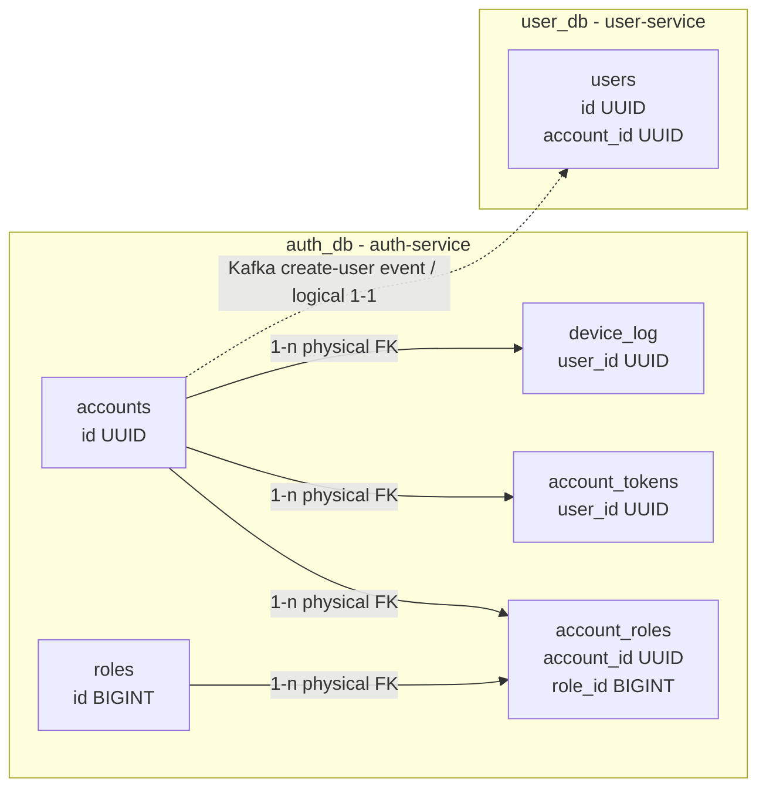
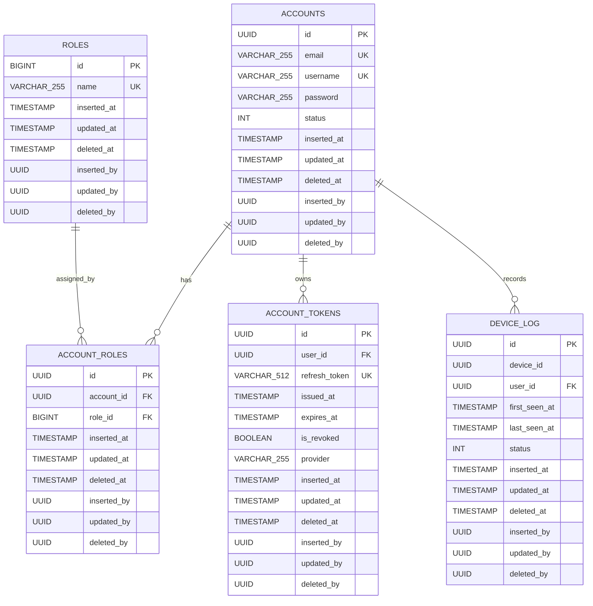
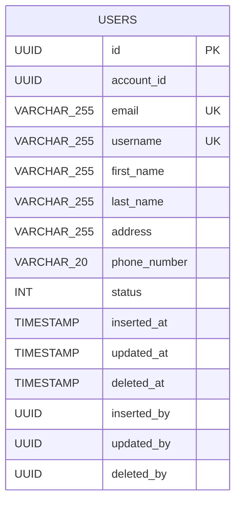
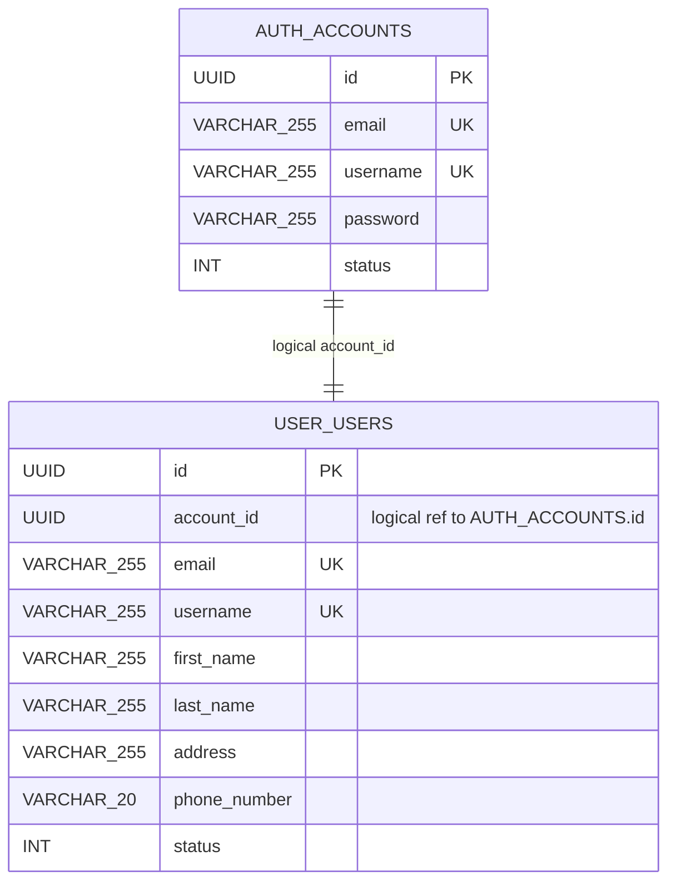

# Database Design: auth-service and user-service

Tai lieu nay ve lai thiet ke database cho `auth-service` va `user-service` theo Liquibase changelog hien tai.

## Tong quan kien truc du lieu

- `auth-service` su dung PostgreSQL database rieng: `auth_db`.
- `user-service` su dung PostgreSQL database rieng: `user_db`.
- Hai service khong co foreign key vat ly giua database. Lien ket nghiep vu duoc thuc hien bang `account_id` va Kafka event.
- `auth-service.accounts.id` la identity goc cua tai khoan dang nhap.
- `user-service.users.account_id` la ban sao tham chieu logic den `auth-service.accounts.id`.

## auth-service ERD

### auth-service quan he

| Bang nguon | Cot | Bang dich | Cot | Loai |
| --- | --- | --- | --- | --- |
| `account_roles` | `account_id` | `accounts` | `id` | Physical FK |
| `account_roles` | `role_id` | `roles` | `id` | Physical FK |
| `account_tokens` | `user_id` | `accounts` | `id` | Physical FK |
| `device_log` | `user_id` | `accounts` | `id` | Physical FK |

## user-service ERD

## Quan he logic giua auth-service va user-service

Luồng tao user hien tai:

1. `auth-service` tao record trong `accounts`.
2. `auth-service` publish event/command tao user qua Kafka, gom `accountId`, `email`, `username`.
3. `user-service` consume event va tao record trong `users` voi `users.account_id = accounts.id`.
4. Neu tao user that bai, co co che rollback/failed event de xu ly buoc bu tru.

## Ghi chu can kiem tra

- Trong entity `User`, `account_id` co `unique = true`, nhung Liquibase changelog cua `user-service` chua khai bao unique constraint cho cot nay. Neu nghiep vu la moi account chi co mot user profile, nen them unique constraint vao migration.
- Trong `account_tokens` va `device_log`, cot `user_id` thuc te dang foreign key den `accounts.id`. Ten `account_id` se ro nghia hon neu sau nay refactor schema.
- Entity `AccountToken` khai bao `expires_at` va `is_revoked` la `nullable = false`, nhung Liquibase changelog hien tai chua dat `nullable="false"` cho hai cot nay.
